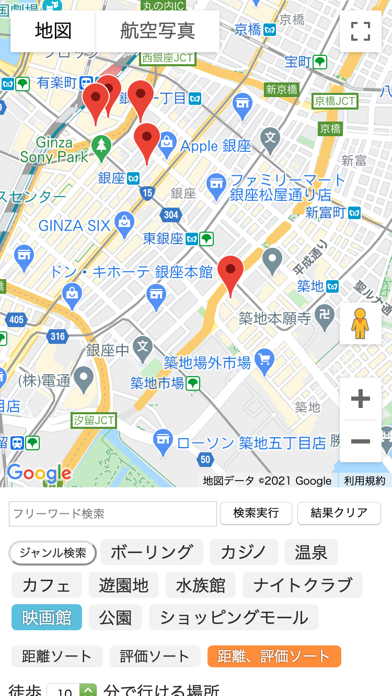
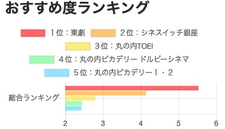
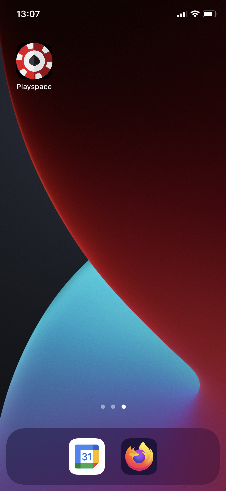

# PlaySpace

デモ版：https://limich001.github.io/PlaySpace/

Google map よりも手軽に簡単に遊ぶ場所の検索をしたい
学生向けの
PlaySpaceというプロダクトは
場所検索ツールです。
これは、検索するまでの時間を短縮でき、
Google Mapとは違って、
より見やすく、より早いという特徴が備わっています。

## 使い方
- フリーワード検索
ワードを入れて検索実行ボタンを押す。
- ジャンル検索
好きなジャンルを選び、ソート方法を選択した後、ジャンル検索ボタンを押す。
- 時間指定
5分単位で5〜30分の時間指定が可能。
- 総合ランキング
選択したソート方法に基づいて、おすすめ度を視覚化する。

## 総合ランキングの評価方法
計算式は
(評価+10)/(距離*10)
です。

## PWA ダウンロード
デモページからダウンロードすることで、ホーム画面からいつでもアクセスできるPWAとして機能します。

iPhoneの場合はSafariで開く必要があります。

